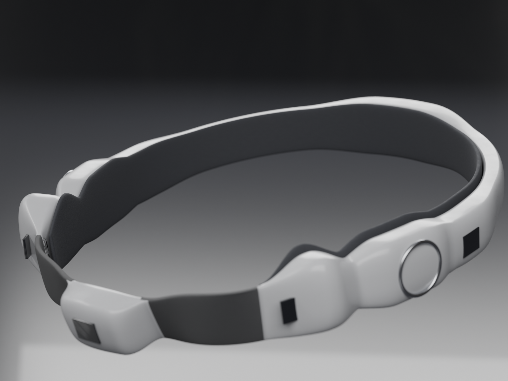
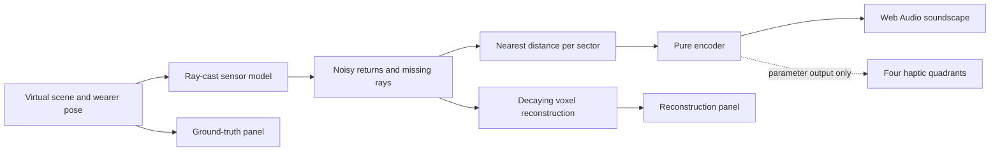

# VisionBand — Spatial Awareness Through Sound and Touch

> **Simulate the sensing, test the encoding, validate perception before claiming navigation.**
> Current evidence is software behavior and concept geometry, not a working assistive device.

VisionBand explores a head-worn system that communicates surrounding space through bone-conduction
audio and tactile feedback. The intended user is a blind person choosing their own movement and
interactions. The published prototype investigates a narrower question: how simulated range
returns become a spatial soundscape, and what the model misses along the way.



*Concept render from the tracked CAD model. It is not a photograph of manufactured hardware.*

## Evaluate the prototype

**No hardware or API key required.** Use Python 3 to serve the browser simulator and Node.js for
its tests and bundler. No npm install or package manager setup is needed. The checks below were run
on **7 October 2026**, with Node **v26.0.0**, Python **3.14.5** and Chrome.

From the repository root:

```sh
node --test sonification/encoder.test.mjs sim/bvh.test.mjs
python3 -m http.server 8000 --bind 127.0.0.1
```

Open [the simulator](http://127.0.0.1:8000/sim/) in a WebGL-capable browser. The page loads Three.js
from a CDN and a web font from Google; **the browser demo is not fully offline**. The Node tests
use local files and need no network. Opening `sim/index.html` directly is insufficient because it
uses ES modules and fetches the room assets.

1. Start with **Corridor (test rig)**. Compare the ground-truth panel with the reconstruction.
2. Switch **Zones** to **8×8** before interpreting the discrete-sensor model. The UI defaults to
   **24×24**, a denser hypothetical configuration, not a free upgrade to an 8×8 sensor.
3. Compare **4**, **6** and **8** horizontal sensors; toggle the additional **Ground sensor**.
   Read the coverage and gap values as outputs of the current geometry assumptions.
4. Hide **Show truth panel** to inspect only the reconstructed map. Move and turn the virtual
   wearer; identify what persists, disappears or fails to return.
5. Select **Living room (105k tris)** after it loads. The imported room contains 104,624 triangles.
6. For an audio demonstration, lower the volume before clicking **Enable sound**. Compare the
   **Voices** setting from 1 to 8. Audible output is not evidence of correct perception through
   bone conduction. **Mute** controls sound separately from **Pause**, which stops simulation time.

Read next: [encoding](docs/01-encoding-spec.md), [test protocol](docs/03-test-protocol.md),
[prototype requirements](docs/00-requirements.md), then the
[design decision](docs/decisions/0001-stereo-bone-conduction-not-eight-pads.md).
These documents describe the earlier prototype plan; targets and hardware choices remain subject
to research and validation.

### Verified checks and their limits

| Check | Result on 7 October 2026 | What it establishes |
|---|---|---|
| Encoder tests | 10 passed, 0 failed | Binning, proximity, gating, audio/haptic parameters |
| Ray-intersection tests | 3 passed, 0 failed, 0 skipped | BVH behavior against brute force |
| Golden vectors | 8 cases checked by the encoder suite | Reference output conformance |
| Imported-room comparison | 2,000/2,000 seeded rays agreed | BVH agreement on this mesh |
| Room assets | 49,248 vertices, 104,624 triangles | Contents of the supplied model |
| Bundle generation | 2 HTML files generated | Modules and room embedded successfully |
| Browser checks | Source and bundle loaded the room | Rendering and scene/zone controls |

**13 tests passed in total; zero failed or skipped.** These are engineering checks, not human
perception or mobility results. Browser audio perception, physical transducers, tactile actuators,
CAD regeneration and milestone gates were not validated by this verification.

The ray test prints timing comparisons and a projected per-tick cost. Those are measurements of
one algorithm on the machine running the test, not end-to-end device latency or portable speed
claims. The simulator's **Scan time** HUD also excludes the complete sensing-to-perceived-feedback
path. No passed human trial is recorded in the tracked test protocol.

## What exists today

**M0 — simulation and concept development.** The published repository contains a browser simulator,
a pure JavaScript sonification encoder, test vectors, a ray-intersection test suite, a bundler,
and Blender headband scripts with rendered concepts. It does not contain phone or embedded
firmware, a real sensor acquisition loop, a built headband or blind-user validation results.

The broader ambition is usable spatial understanding through sound and touch. This build provides
nearest-range cues; it does not demonstrate object recognition, person tracking, queue recognition
or independent navigation. Concept images and simulated coverage must not stand in for those
capabilities.

The earlier requirements frame the prototype as a cane complement. No capability to replace a
cane or guide dog has been demonstrated. Early mobility testing retains the supervised protections
in the [test protocol](docs/03-test-protocol.md).

## How the simulator works



The reconstruction and soundscape share sensor returns but take different paths. The voxel map
accumulates and decays observations; **audio uses the current returns**, collapsed to the nearest
value in each head-relative sector. It is not sonifying the complete accumulated room map.

| Stage | Implemented behavior |
|---|---|
| Virtual world | Procedural corridor or imported room; simulated wearer movement |
| Sensor rig | 4/6/8 horizontal units plus optional down-pitched ground unit |
| Ray sampling | Configurable zone grids, finite range, random jitter/noise/dropout |
| Reconstruction | Occupied voxels, ray carving and decay; visual debugging output |
| Sector map | Eight 45° sectors; nearest return wins within each sector |
| Encoding | Proximity, selected voices, pan, pitch, pulse rate and rear filtering |
| Audio rendering | Browser oscillators, filters, stereo panning and gain control |
| Haptics | Four numerical intensity outputs; no actuator driver in the browser loop |

The reconstruction's colors come from **known scene labels**. They help debug simulated returns;
they are not object classes inferred by a sensor or recognition model. The visual interface is an
engineering instrument, not the intended blind-user interface.

## Encoding: what the signal carries

The reference is [sonification/encoder.js](sonification/encoder.js), with the mathematical
specification in [docs/01-encoding-spec.md](docs/01-encoding-spec.md).

| Input or cue | Current default |
|---|---|
| Sector layout | 8 sectors, 45° each; sector 0 faces forward |
| Range mapping | Proximity saturates at 0.30 m; zero at 4.00 m and beyond |
| Proximity curve | Exponent 1.6; nearer returns receive greater salience |
| Voice selection | Up to 3 sectors above the 0.02 proximity floor |
| Bearing | Stereo pan = sine of sector bearing |
| Elevation | Pitch relative to a 220 Hz base carrier |
| Distance | Gain, tremolo depth and pulse rate from 2 to 14 Hz |
| Rear cue | Rear sectors low-passed at 1,200 Hz |
| Touch | Four overlapping quadrants; steeper response and a 0.25 floor |

A missing return remains `Infinity` in the sector map: **unknown is not clear**. The encoder makes
unknown sectors silent. That preserves the data distinction but does not give the listener a
separate unknown-space cue. Silence therefore must not be treated as a safe-path instruction.

Front/back pairs can have identical stereo pan. The rear filter is a proposed disambiguating cue;
its presence in code does not prove a listener can distinguish it. Likewise, the default three
voices are a design parameter, not a measured perceptual capacity.

The encoder is separate from the DOM and audio API so its outputs can be compared across platforms.
The implementation here is **JavaScript**. Swift and C++ ports are planned, not supplied. Future
ports must match [the eight golden vectors](sonification/vectors.json). Regenerate them only after
a deliberate specification change:

```sh
node sonification/generate-vectors.mjs
```

## Quickstart: source and portable bundle

### A. Serve the source

```sh
python3 -m http.server 8000 --bind 127.0.0.1
```

Open `http://127.0.0.1:8000/sim/`. To start in the imported room, append `#room`:
`http://127.0.0.1:8000/sim/#room`. Stop the server with Ctrl+C when finished.

| Control | Action |
|---|---|
| W / A / S / D | Move the virtual wearer |
| Left / right arrows | Turn the simulated head |
| Shift | Move faster |
| Drag / scroll | Orbit / zoom the inspection camera |
| Scene | Switch corridor / imported room |
| Sensors / Zones | Change model sampling geometry; clears the voxel map |
| Ground sensor | Include or remove the additional down-pitched model sensor |
| Show truth panel | Compare reality with reconstruction, or hide the answer |
| Voices / Volume | Change simultaneous audio channels and master gain |
| Enable sound / Mute | Start / silence browser audio |
| Pause / Play | Stop / resume simulation time |
| Clear map | Reset accumulated reconstruction |

### B. Build a single-file demo

```sh
node tools/bundle.mjs
```

Outputs:

- `dist/visionband-sim.html` — full HTML page with application modules and room data embedded.
- `dist/visionband-sim.artifact.html` — variant without the outer document shell,
  for compatible hosts.

Open the full HTML file in your browser, or serve it at
`http://127.0.0.1:8000/dist/visionband-sim.html`. The bundle removes local module/room dependencies;
it still loads Three.js and fonts from external services. Host permissions can affect rendering.
`dist/` is ignored by Git and can be regenerated from the tracked sources.

## Built, proposed and unverified

| State | Components |
|---|---|
| Built in software | Simulator, imported room, ray acceleration, reconstruction, encoder, audio |
| Built as checks/assets | Encoder/BVH tests, golden vectors, bundler, Blender scripts and renders |
| Proposed hardware | Ranging layout, two bone-conduction contacts, four tactile quadrants |
| Planned platforms | Phone prototype and embedded implementation |
| Unverified | Physical sensing, perceptual cues, comfort, power, latency and navigation utility |

“Built” describes code or assets present in this repository. It does not describe manufactured
hardware. The CAD dimensions, component placements and mass estimates are design inputs, not
physical measurements or a frozen bill of materials.

The earlier milestone sequence is **M0 simulation → M1 phone prototype → M2 bench hardware →
M3 form factor → M4 PCB/enclosure → M5 blind-user validation**. It is a proposed progression;
this repository does not record that those gates passed. Perception and sensor evidence must inform
hardware selection and enclosure decisions.

## Sensor-model limits and corrected interpretation

The rig is a ray-cast approximation with stochastic return noise and dropout. It can expose
consequences of its assumptions; it cannot establish how a real sensor behaves on the same scene.
Unseeded randomness also means interactive reconstructions vary between runs.

**Field of view is an unresolved model mismatch.** `sim/sensor.js` uses 63° on both angular axes.
The earlier README used this model to argue four sensors were insufficient and six sufficient.
Those figures must not decide a physical sensor count. ST's current VL53L5CX datasheet lists
45° horizontal/vertical detection volume and 65° diagonal under specified measurement conditions;
ST's earlier announcement used 63° **diagonal**, not horizontal. Sources checked 7 October 2026:
[current datasheet][st-datasheet], [2021 announcement][st-announcement].

This comparison changes the documentation conclusion, not the simulation code: coverage/gap HUD
values remain **model outputs pending calibrated geometry and bench measurements**. Denser zone
settings are exploratory alternatives. They do not establish that the named 8×8 part supports them.

Other limits:

- **Sensor physics:** multipath, sunlight, angle-dependent glass/wet-surface returns,
  retroreflection and multi-sensor cross-talk are not validated by this model.
- **Drop-offs:** the optional down-pitched sensor explores sampling the ground; it does not provide
  a validated drop-off classifier or alarm. Missing returns remain ambiguous.
- **Perception:** stereo cues through bone conduction, rear filtering, elevation pitch and voice
  load have no recorded human pass here. Contact placement is not settled by the CAD render.
- **Physical output:** haptics are numerical parameters. Browser gain/compression does not calibrate
  real acoustic or vibration exposure, nor prove a physical output limit.
- **Pose and scene knowledge:** the simulation has known wearer pose and scene geometry. Real
  tracking, calibration, motion errors and semantic inference are not implemented.
- **Environmental use:** battery life, mass, wear comfort, weather and outdoor performance remain
  targets in prototype documents, not verified capabilities.

[st-datasheet]: https://www.st.com/resource/en/datasheet/vl53l5cx.pdf
[st-announcement]: https://newsroom.st.com/media-center/press-item.html/n4388.html

## Test gates and human evidence

[docs/03-test-protocol.md](docs/03-test-protocol.md) defines the earlier evaluation proposal:

| Gate | Proposed criterion | Recorded result |
|---|---|---|
| Reconstruction | Locate doorway, pillar and drop-off within 1 m | Not recorded |
| Bearing and range | At least 40/50 correct for each; ±1 sector accepted | Not recorded |
| Front/back | At least 15/20 correct | Not recorded |
| End-to-end latency | Worst of 10 trials ≤150 ms | Not recorded |

These are proposed progression thresholds, not measured performance or established study validity.
A sighted eyes-closed engineering trial does not establish blind-user efficacy. Tests of the
intended bone-conduction channel need the actual output apparatus; ordinary headphones can debug
audio generation but do not establish that transfer.

The existing early-mobility protocol requires the participant's own cane, a sighted guide within
arm's reach, no roads/stairs/platform edges, written consent and an immediate stop option. This
README's runnable demonstration is virtual; it is not an instruction to navigate with the device.

## CAD concepts

The tracked [studio renders](cad/studio/) show proposed geometry and appearance. Blender scripts
build a headband around a downloadable reference head mesh. They are separate from simulator
verification and were not rerun for this README update.

For CAD iteration, install Blender separately and obtain the reference mesh:

```sh
python3 cad/fetch_head.py
blender --python cad/launch.py
```

`blender` must be available on your PATH. The fetch script downloads third-party assets into the
ignored `cad/assets/` directory. Launch the model in a new Blender session: the launcher rebuilds
the scene and removes objects outside the model. Optional rendering commands are documented in
[cad/render_preview.py](cad/render_preview.py) and [cad/render_studio.py](cad/render_studio.py).
Do not infer manufactured fit, comfort or electrical feasibility from these images.

## Repository map

| Path | Purpose |
|---|---|
| `sim/index.html`, `sim/main.js` | Browser interface and simulation wiring |
| `sim/sensor.js` | Configurable ray-bundle sensor approximation |
| `sim/reconstruct.js` | Decaying voxel map and visual reconstruction |
| `sim/bvh.js`, `sim/world.js` | Accelerated intersections and world data |
| `sim/scene.js`, `sim/room.js`, `sim/rooms/` | Corridor and imported living-room assets |
| `sim/audio.js` | Web Audio renderer for encoder output |
| `sonification/` | Pure encoder, golden vectors, generator and tests |
| `tools/bundle.mjs`, `tools/import-room.mjs` | Demo bundling and OBJ room preprocessing |
| `cad/` | Blender geometry, asset helpers and tracked concept renders |
| `docs/` | Earlier requirements, encoding, proposed gates and design rationale |

## If the demo does not work

| Symptom | Check |
|---|---|
| Blank page / `THREE` unavailable | CDN access, WebGL support and browser console |
| Modules or room fetch fail | Serve from the repository root; avoid opening source HTML directly |
| Living room unavailable | Keep both `livingroom.json` and `livingroom.bin`; corridor still runs |
| No sound | Click Enable sound, check volume/output; missing returns can also be silent |
| Slow scans | Reduce Zones; scan cost is not proof of full-loop latency |
| Room test skipped | Restore the tracked room binary; a skip does not verify that scene |
| Bundle omits room | Inspect the bundler warning and restore room assets before rebuilding |
| CAD cannot load | Check Blender and fetched reference assets; simulator needs neither |
